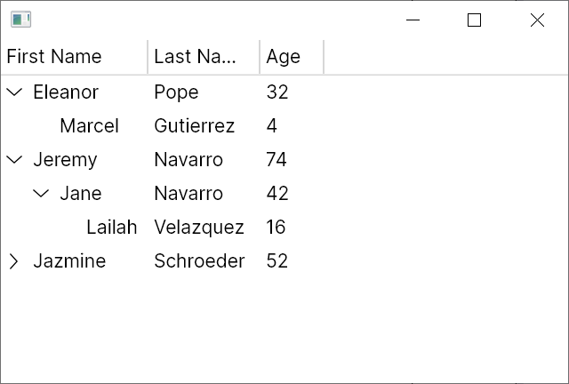

# Creating a Hierarchical TreeDataGrid

There are two parts to any `TreeDataGrid`:

- The "Source" which is defined in code and describes how your data model will map to the rows and columns of the `TreeDataGrid`
- The control which can be instantiated from XAML or from code and describes how the `TreeDataGrid` will appear

The source is usually defined at the view model layer if you're using the MVVM pattern but can also be defined in code-behind. This introduction will assume that you're using the MVVM pattern.

This article assumes that you are using C# 10 and have [nullable reference types](https://docs.microsoft.com/en-us/dotnet/csharp/nullable-references) enabled.

## Installation

First follow the [installation](installation.md) instructions, ensuring that you add the theme to your `App.axaml` file.

## The Data Model

The data model is your "source" data that will be displayed in the `TreeDataGrid` and will be specific to your application. For this introduction we will be using a very simple `Person` class:

```csharp
public class Person
{
    public string? FirstName { get; set; }
    public string? LastName { get; set; }
    public int Age { get; set; }
    public ObservableCollection<Person> Children { get; } = new();
}
```

First we create a `MainWindowViewModel` containing our simple dataset:

```csharp
using System.Collections.ObjectModel;
using Avalonia.Controls;
using Avalonia.Controls.Models.TreeDataGrid;

public class MainWindowViewModel
{
    private ObservableCollection<Person> _people = new()
    {
        new Person 
        { 
            FirstName = "Eleanor", 
            LastName = "Pope", 
            Age = 32,
            Children =
            {
                new Person { FirstName = "Marcel", LastName = "Gutierrez", Age = 4 },
            }
        },
        new Person 
        { 
            FirstName = "Jeremy",
            LastName = "Navarro",
            Age = 74,
            Children =
            {
                new Person 
                { 
                    FirstName = "Jane",
                    LastName = "Navarro",
                    Age = 42 ,
                    Children =
                    {
                        new Person { FirstName = "Lailah ", LastName = "Velazquez", Age = 16 }
                    }
                },
            }
        },
        new Person { FirstName = "Jazmine", LastName = "Schroeder", Age = 52 },
    };
}
```

We store the data in an [`ObservableCollection<T>`](https://docs.microsoft.com/en-us/dotnet/api/system.collections.objectmodel.observablecollection-1?view=net-6.0) which will allow the `TreeDataGrid` to listen for changes in the data and automatically update the UI.

## The `TreeDataGrid` source

The source defines how to map the data model to rows and columns. Because we're displaying hierarchical data, we'll use a `HierarchicalTreeDataGridSource<Person>`. `HierarchicalTreeDataGridSource` is a generic class where the type parameter represents the data model type, in this case `Person`.

The constructor to `HierarchicalTreeDataGridSource` accepts a collection of type `IEnumerable<T>` to which we'll pass our data set. 

We'll create the source in the `MainWindowViewModel` constructor, add three columns, and expose the source in a property:

```csharp
public class MainWindowViewModel
{
    private ObservableCollection<Person> _people = /* defined earlier */

    public MainWindowViewModel()
    {
        Source = new HierarchicalTreeDataGridSource<Person>(_people)
        {
            Columns =
            {
                new HierarchicalExpanderColumn<Person>(
                    new TextColumn<Person, string>("First Name", x => x.FirstName),
                    x => x.Children),
                new TextColumn<Person, string>("Last Name", x => x.LastName),
                new TextColumn<Person, int>("Age", x => x.Age),
            },
        };
    }

    public HierarchicalTreeDataGridSource<Person> Source { get; }
}
```

The first column above is defined as a `HierarchicalExpanderColumn`. Its first constructor parameter defines how the data in the column will be displayed. For this we're using a `TextColumn` - see below for details of its constructor parameters. The second parameter to the `HierarchicalExpanderColumn` constructor is a lambda which selects the property which will contain the children of each row.

The remaining columns are also defined as `TextColumn`s - again, `TextColumn` is a generic class that accepts the data model type and a value type. The first parameter to `TextColumn` is the header to display in the column and the second parameter is a lambda expression which selects the value to display from the data model.

## The `TreeDataGrid` control

It's now time to add the `TreeDataGrid` control to a window and bind it to the source.

```xml
<Window xmlns="https://github.com/avaloniaui"
        xmlns:x="http://schemas.microsoft.com/winfx/2006/xaml"
        x:Class="AvaloniaApplication.MainWindow">
  <TreeDataGrid Source="{Binding Source}"/>
</Window>
```

## Run the Application

Run the application and you should see the data appear:


